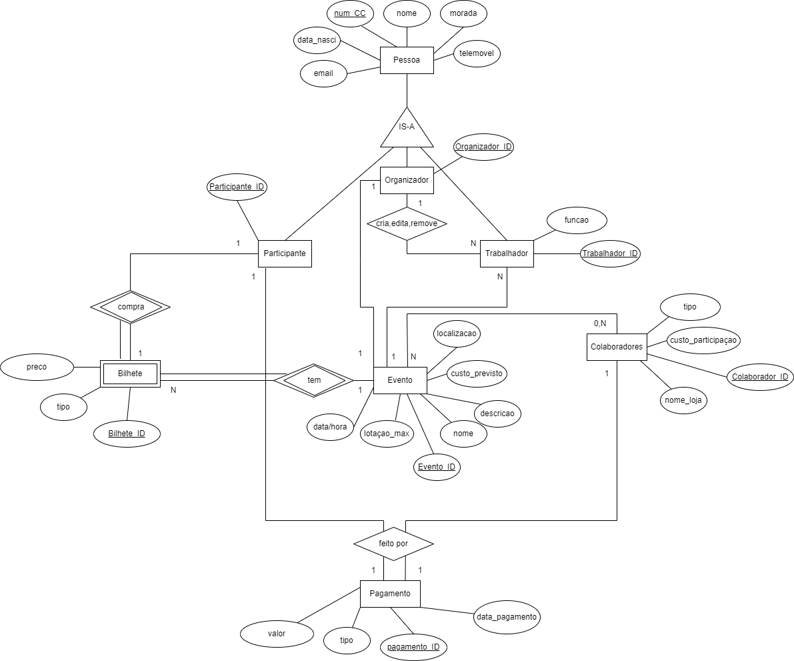
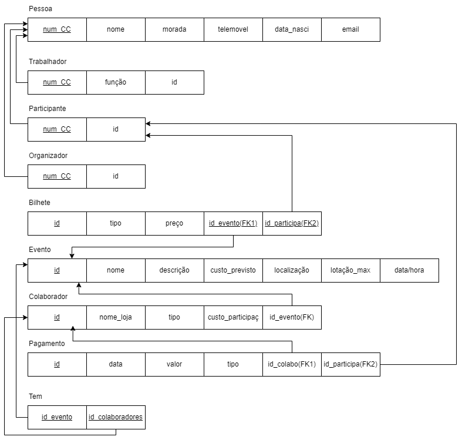

# BD: Trabalho Prático APFE

**Grupo**: P2G11
- Miguel Soares Francisco, MEC: 108304
- Regina Tavares, MEC: 114129

## Introdução / Introduction
 ```
O nosso projeto de desenvolvimento para o EventPro, sistema de
gerenciamento de eventos, surge da demanda identificada no mercado por uma
solução abrangente para organizadores e participantes de eventos. O objetivo
principal é oferecer aos utilizadores uma plataforma completa para acompanhar e
gerir eventos, desde a temporada atual até informações sobre eventos passados.
Os utilizadores terão acesso a uma variedade de funcionalidades, incluindo
o acompanhamento da programação de eventos, informações detalhadas sobre
os organizadores, participantes e colaboradores envolvidos, bem como detalhes
sobre os custos previstos e a lotação máxima de cada evento. Além disso, os
utilizadores poderão consultar informações sobre bilhetes restantes para os
eventos, facilitando o processo de reserva e participação.
Além das funcionalidades básicas de acompanhamento de eventos, o
nosso objetivo é criar uma comunidade interativa de organizadores e participantes
de eventos. Futuramente, os utilizadores poderão criar perfis personalizados,
interagir uns com os outros, partilhar experiências e opiniões, e até mesmo
participar de discussões sobre a gestão e organização de eventos. Isso promoverá
uma maior colaboração e envolvimento entre os utilizadores e enriquecerá a
experiência geral com o sistema.
Para garantir a precisão e atualização das informações, planejamos
recolher dados de diversas fontes, incluindo websites oficiais de eventos,
fornecedores e outras fontes confiáveis. Essa abordagem garantirá que os
utilizadores tenham acesso a informações atualizadas e relevantes sobre os
eventos gerenciados pelo sistema.
Em resumo, o nosso objetivo é fornecer uma solução completa para
organizadores e participantes de eventos, oferecendo acesso fácil e conveniente a
todas as informações necessárias, desde o planeamento até a execução do
evento. Estamos ansiosos para desenvolver essa plataforma e oferecer uma
experiência de gestão de eventos única e eficaz aos utilizadores do EventPro.
```
## ​Análise de Requisitos / Requirements


## DER




## ER

