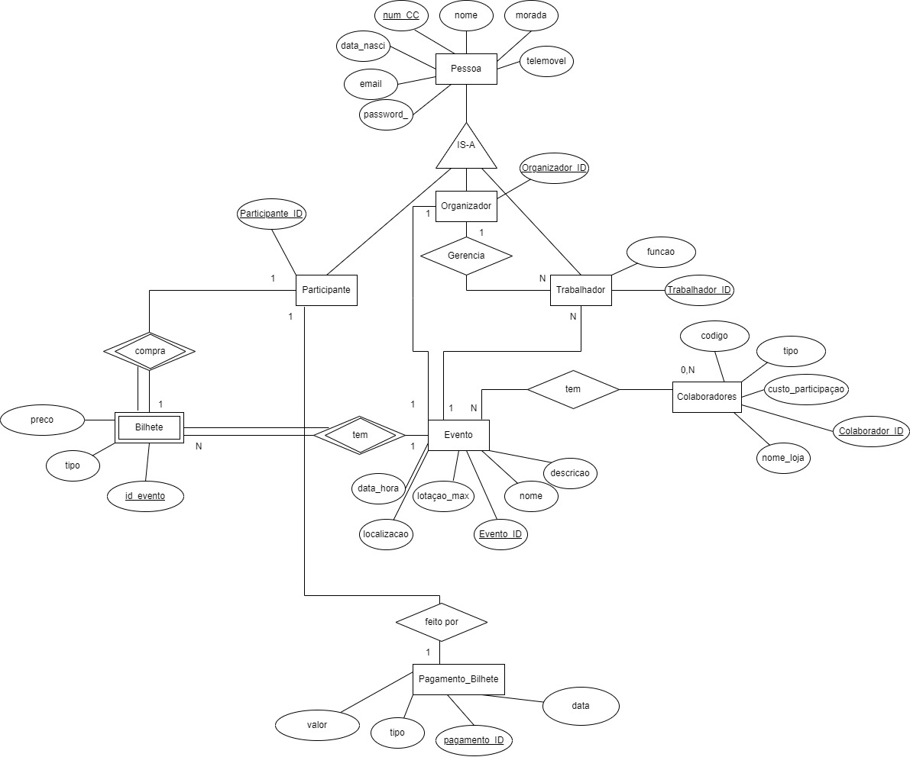
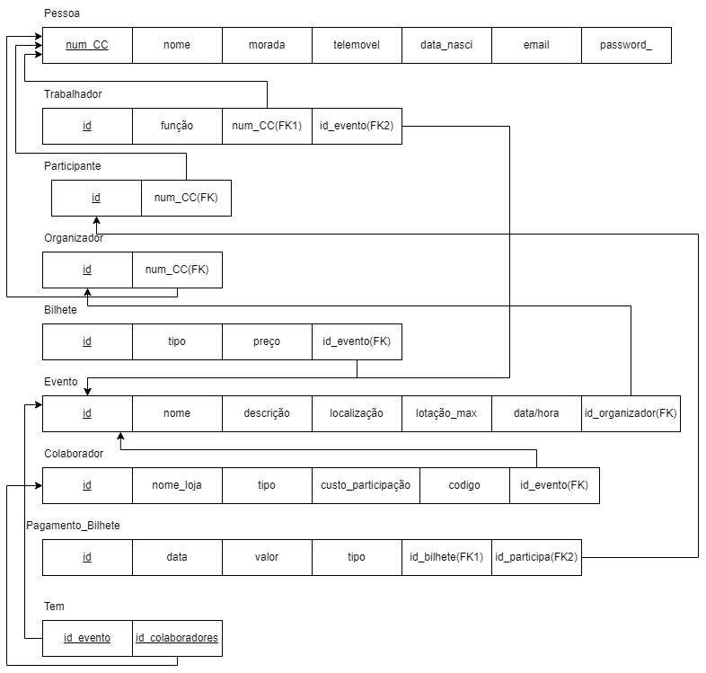

# BD: Trabalho Prático APF-T

**Grupo**: P2G11
- Miguel Soares Francisco, MEC: 108304
- Regina tavares, MEC: 114129

# Instructions - TO REMOVE

Este template é flexível.
É sugerido seguir a estrutura, links de ficheiros e imagens, mas adicione ou remova conteúdo sempre que achar necessário.

---

This template is flexible.
It is suggested to follow the structure, file links and images but add more content where necessary.

The files should be organized with the following nomenclature:

- sql\01_ddl.sql: mandatory for DDL
- sql\02_sp_functions.sql: mandatory for Store Procedure, Functions,... 
- sql\03_triggers.sql: mandatory for triggers
- sql\04_db_init.sql: scripts to init the database (i.e. inserts etc.)
- sql\05_any_other_matter.sql: any other scripts.

Por favor remova esta secção antes de submeter.

Please remove this section before submitting.

## Introdução / Introduction
 
O nosso projeto de desenvolvimento para o EventPro, sistema de gestão de eventos, surge da demanda identificada no mercado por uma solução abrangente para organizadores e participantes de eventos. O objetivo principal é oferecer aos utilizadores uma plataforma completa para acompanhar e gerir eventos.

Os utilizadores terão acesso a uma variedade de funcionalidades, incluindo o acompanhamento da programação de eventos, informações detalhadas sobre os trabalhadores e colaboradores envolvidos, bem como estatísticas sobre as vendas, a lotação máxima de cada evento, etc. Além disso, os utilizadores poderão consultar informações sobre bilhetes restantes para os eventos, facilitando o processo de reserva e participação.

Para garantir a precisão e atualização das informações, recolhemos dados de diversas fontes, incluindo websites oficiais de eventos, fornecedores e outras fontes confiáveis. Essa abordagem garante que os utilizadores tenham acesso a informações atualizadas e relevantes sobre os eventos geridos pelo sistema.

## ​Análise de Requisitos / Requirements

## DER - Diagrama Entidade Relacionamento/Entity Relationship Diagram

### Versão final/Final version




### APFE 

Neste diagrama optamos por adicionar um atributo codigo ao Colaborador para este conseguir iniciar sessão, removemos o custo_previsto do Evento pois não nos ia ajudar em nada, e por fim adaptamos a parte do pagamento para pagamento do bilhete.

## ER - Esquema Relacional/Relational Schema

### Versão final/Final Version




### APFE

Neste diagrama optamos por colocar o id em vez de num_CC como chave primaria nas varias entidades e passamos o num_CC para um Foreign Key.
Para corrigir a parte da entidade do Pagamento retiramos a ligaçao deste com o colaborador e tambem retiramos o id do participante da entidade Bilhete, por fim adicionamos no Pagemnto do bilhete uma foreign key que aponta para a entidade Bilhete.

## ​SQL DDL - Data Definition Language

[SQL DDL File](sql/01_ddl.sql "SQLFileQuestion")

## SQL DML - Data Manipulation Language

Uma secção por formulário.
A section for each form.

### Formulario exemplo/Example Form


```sql
-- Show data on the form
SELECT * FROM MY_TABLE ....;

-- Insert new element
INSERT INTO MY_TABLE ....;
```

...

## Normalização/Normalization

Para minimizar a duplicação de dados, aplicamos as seguintes regras de normalização:

Primeira Forma Normal (1NF): Eliminar grupos repetitivos criando tabelas separadas para cada conjunto de dados relacionados.

Segunda Forma Normal (2NF): Remover dados redundantes garantindo que cada atributo não-chave dependa da chave primária.

Terceira Forma Normal (3NF): Eliminar dependências transitivas, assegurando que atributos não-chave são dependentes apenas da chave primária.

## Índices/Indexes

Descreva os indices criados. Junte uma cópia do SQL de criação do indice.
Describe the indexes created. Attach a copy of the SQL to create the index.

```sql
-- Create an index to speed
CREATE INDEX idx_bilhete_preco ON EventPro.Bilhete(preço);
CREATE INDEX idx_colaborador_tipo ON EventPro.Colaborador(tipo);
CREATE INDEX idx_evento_localizacao ON EventPro.Evento(localização);
CREATE INDEX idx_evento_data_hora ON EventPro.Evento(data_hora);


```

## SQL Programming: Stored Procedures, Triggers, UDF

[SQL SPs and Functions File](sql/02_sp_functions.sql "SQLFileQuestion")

[SQL Triggers File](sql/03_triggers.sql "SQLFileQuestion")

## Outras notas/Other notes

### Dados iniciais da dabase de dados/Database init data

[Indexes File](sql/01_ddl.sql "SQLFileQuestion")

### Apresentação

[Slides](slides.pdf "Sildes")

[Video](video.mp4)


 